# ESP32APRS Audio HARC

An ESP32-based APRS weather station, forked from [ESP32APRS_Audio](https://github.com/nakhonthai/ESP32APRS_Audio) by Somkiat Nakhonthai (HS5TQA) and customized for the Halifax Amateur Radio Club (HARC) Builders Group.

> **Note:** This is a fork. It retains the full capability of the upstream project (IGate, Digipeater, Tracker, Telemetry, messaging, etc.) but has been tuned, patched, and documented specifically for weather station use. The original upstream README is preserved as [`README-upstream.md`](README-upstream.md) for reference.

---

## Introduction

The Halifax Amateur Radio Club (HARC) has a Builders Group that meets on Sundays during the winter, January through May. One of the projects proposed for 2026 was the construction of a weather station that uses APRS for communications, allowing the station to be sited in a location with no access to the Internet.

An initial investigation discovered the excellent open-source project **ESP32APRS_Audio** by Somkiat Nakhonthai (HS5TQA). The author describes it as:

> *"ESP32APRS Audio is an Internet Gateway (IGate) / Digital Repeater (DiGi) / Tracker / Weather (WX) / Telemetry (TLM) with AFSK/GFSK TNC built in, implemented for the Espressif ESP32 processor."*

The upstream project is hosted on GitHub at <https://github.com/nakhonthai/ESP32APRS_Audio>.

This is a large and actively developed project that provides far more capability than weather reporting alone. After a few weeks of evaluation the Builders Group concluded that it was more than suitable for our needs, and this fork was created to adapt it to the group's specific objectives.

---

## Overview

This fork focuses on making the upstream project easy to build, flash, and configure as a weather station while preserving its other capabilities.

- **Customized for the HARC Builders Group's objectives.** Default configuration, documentation, and tooling have been tailored to a weather station use case, so a new builder can go from a blank board to a transmitting station with a minimum of setup.
- **Compatible with readily available ESP32-S3 development boards.** Pre-built firmware and PlatformIO build environments are provided for several common boards — see [Hardware](#hardware) below.
- **Custom PCB.** A simple carrier board was designed by the Builders Group to simplify construction, provide connections for the audio interface and sensors, and make the project approachable for members who are new to embedded electronics.
- **Flexible sensor integration.** The primary way to connect weather sensors is to wire them directly to the board and configure them through the **MOD**, **Sensor**, and **System** pages of the web UI. For situations where a sensor can't conveniently be located close to the board, a secondary path uses **Modbus TCP** to read values from a remote gateway — see the companion project [ESP32-S3-WX-Modbus](https://github.com/RocketManRC/ESP32-S3-WX-Modbus). The upstream Modbus code only supported serial (RTU); this fork adds TCP by migrating to a local copy of [eModbus](https://github.com/eModbus/eModbus). (Modbus RTU is not currently wired up but the code path is retained for future work.)
- **Bug fixes contributed upstream.** Several issues were identified and fixed during evaluation, including a TX/RX mode-switching bug on the ESP32-S3, a ring-buffer race condition that caused long-running dashboard freezes, an inverted LED debounce, and SSE memory growth on the dashboard. These fixes have been reported to the upstream author.
- **Tuned default configuration.** Defaults are set for weather station use out of the box, reducing the number of pages a new user must touch.
- **Tools for monitoring and debugging.** A browser-based firmware flasher and a standalone APRS-IS packet monitor are included — see [Tools](#tools) below.
- **Weather-focused, but other modes still work.** Only weather reporting has been actively tested in this fork. The IGate, Digipeater, Tracker, Telemetry, messaging, and other upstream features remain in the codebase and should continue to function; nothing has been deliberately removed.
- **Claude Code was used extensively.** Claude Code (Anthropic's CLI coding assistant) was used throughout development for investigation, refactoring, documentation, and debugging. The project's [`CLAUDE.md`](CLAUDE.md) captures much of the architectural knowledge that accumulated along the way.

A detailed, chronological list of every change made in this fork is available in [`ESP32APRS_Audio_HARC-all-changes-RocketManRC.md`](ESP32APRS_Audio_HARC-all-changes-RocketManRC.md).

---

## Inherited Upstream Features

The full feature set from upstream is still present. Highlights:

- APRS IGate, Digipeater, Tracker, Weather, Telemetry, and Messaging
- Software TNC with multiple modems: 1200 bps AFSK (Bell 202), 300 bps AFSK (Bell 103), 1200 bps V.23, and 9600 bps GFSK G3RUH
- AX.25 and FX.25 (forward error correction) encode/decode
- Web configuration UI, WebSocket dashboard, and AT-command interface
- Wi-Fi station and access point modes, WireGuard VPN, PPPoS (GSM/cellular)
- MQTT client, Bluetooth SPP/BLE, OLED display support
- External GNSS and TNC over UART or TCP

See [`README-upstream.md`](README-upstream.md) for the complete upstream feature list and documentation.

---

## Hardware

### Development Boards

This fork targets the **ESP32-S3**. The following PlatformIO build environments are provided in [`platformio.ini`](platformio.ini):

| Environment                 | Flash / PSRAM           | Notes                    |
| --------------------------- | ----------------------- | ------------------------ |
| `esp32-s3-devkitc1-n8r2`    | 8 MB flash, 2 MB PSRAM  | Entry-level S3 DevKitC   |
| `esp32-s3-devkitc1-n16r8`   | 16 MB flash, 8 MB PSRAM | **Default build target** |
| `esp32-s3-devkitc-1-n32r8v` | 32 MB flash, 8 MB PSRAM | Large flash variant      |
| `waveshare_esp32_s3_zero`   | 8 MB flash, 2 MB PSRAM  | Compact Waveshare board  |

Other ESP32 variants (plain ESP32, ESP32-C3, ESP32-C6) are still supported by the upstream code although plain ESP32 is known not to work, ESP32-C3 won't build and ESP32-P5 status is unknown.

### HARC Carrier PCB

A small carrier PCB was designed by the HARC Builders Group to simplify assembly, wiring, and construction. It provides the analog signal conditioning needed to interface the ESP32-S3's ADC (GPIO 1, receive audio) and DAC (GPIO 2, transmit audio) to a radio's mic and speaker connections, along with PTT control and headers for directly-wired sensors.

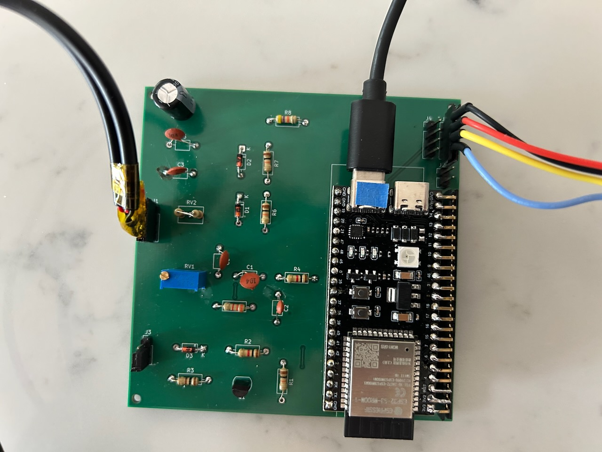

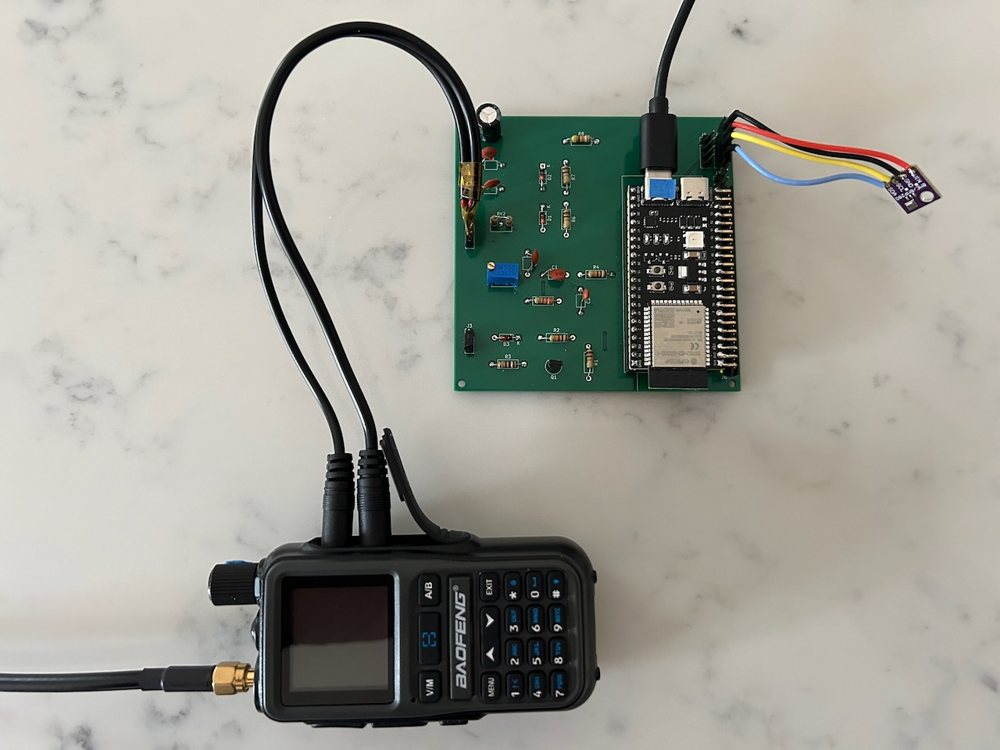

#### Rev 1 required modifications

The rev 1 boards have two issues that must be corrected by hand on every assembled unit. Both will be fixed in the next revision of the PCB.

1. **Add a 10K pullup resistor on the PTT line to the radio.** This is definitely required for **Baofeng** handhelds — without it, PTT does not key reliably. Whether the pullup is needed for other radios has not been fully characterized yet; some may work without it.
2. **Add a missing connection between C2 and ground.** A ground tie to C2 was inadvertently left off the PCB and needs to be jumpered in with a short wire.

The annotated rev 1 schematic below marks up both fixes:

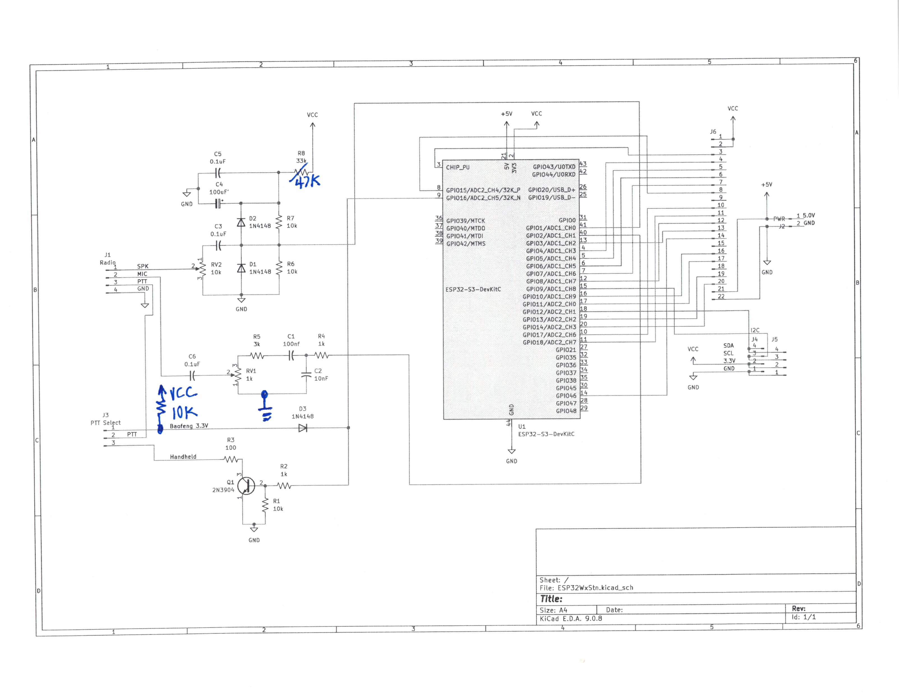

And here is where the modifications land on the back of the board:

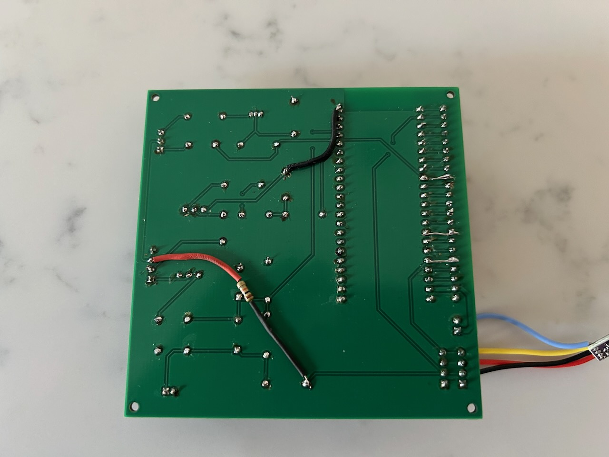

#### Design files and documentation

The following are planned but not yet published:

- Clean (un-annotated) schematic — *TBD*
- PCB layout — *TBD*
- KiCad project — *TBD*

### Weather Sensors

The usual approach is to wire sensors directly to the board; the web UI's **MOD**, **Sensor**, **WX**, and **System** pages cover type selection, scaling, calibration, and how each sensor is mapped into the outgoing APRS weather beacon. When a sensor has to be located away from the board, values can instead be read over Modbus TCP from a companion ESP32-S3 gateway running [ESP32-S3-WX-Modbus](https://github.com/RocketManRC/ESP32-S3-WX-Modbus) — the APRS firmware connects to that gateway's access point (default `192.168.4.2`, port 502) and reads holding registers mapped to individual weather measurements.

---

## Getting Started

The fastest path to a working weather station is to flash a pre-built binary using the included browser-based flasher — no toolchain installation required.

### 1. Flash the firmware

1. Connect the ESP32-S3 board to your computer with a **data-capable** USB cable. If the board has **two** USB-C ports, prefer the one labeled **COM** or **UART** — it generally delivers more reliable power and is where debug output appears (see [Which USB port to use](#which-usb-port-to-use) under Development for details). If the board has only one USB-C port, just use it.
2. Open [`tools/flash.html`](tools/flash.html) in **Chrome or Edge**. (WebSerial is not supported in Safari or Firefox.)
3. Click **Connect** and choose the board's serial port from the picker.
4. Select the firmware binary for your board — e.g. [`tools/ESP32APRS-esp32-s3-devkitc1-n16r8.bin`](tools/).
5. Set the flash address to **`0x0`** (the provided binaries are merged images containing bootloader, partition table, and application).
6. Click **Flash Firmware** and wait for completion. The board resets automatically when done.

See [`tools/FIRMWARE-FLASHER.md`](tools/FIRMWARE-FLASHER.md) for full flasher documentation and troubleshooting.

### 2. Connect to the board

After the first boot, the board comes up as a Wi-Fi access point:

- **SSID:** `ESP32APRS`
- **Password:** `ESP32APRS`
- **Web UI:** <http://192.168.4.1>

Join that network from your computer or phone and open the web UI in a browser. The login user and password are both admin.

During the first three seconds after boot, the status LED cycles red → green → blue. Holding the **BOOT** button during this window triggers a factory reset (the LED will flash white). This is useful if you need to recover from a misconfiguration.

### 3. Configure the board

Work through the web UI pages in this order. You only need to touch a handful of settings for a basic weather station (note that you always have to Apply the change if you make one and switch tabs and come back if you want to make another one).

- **System** — set a unique name for your board's network hostname (e.g. include your callsign), NTP host if desired - ca.pool.ntp.org is good for Canada, Time Zone - need to manually compensate for DST.

  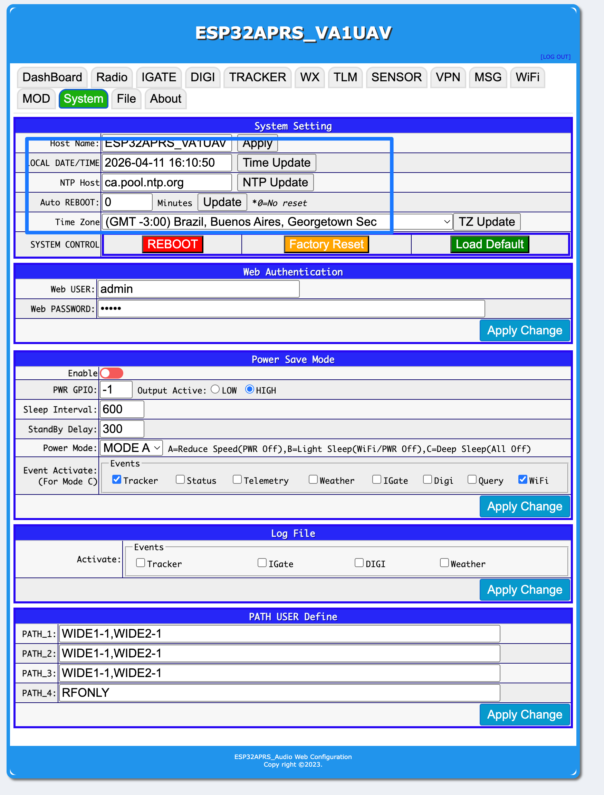

- **MOD** (Modem) — in section RF GPIO Modify the PTT GPIO should be set to 16 and select Active: HIGH if using the board's transistor circuit or LOW otherwise. Enable MODBUS Modify if using the Modbus sensor gateway and configure the gateway's IP address. Enable the I2C_(OLED) Modify section if using an I2C sensor such as a BME280 or if using an OLED. SDA GPIO should be set to 12 and SCK to 9.

  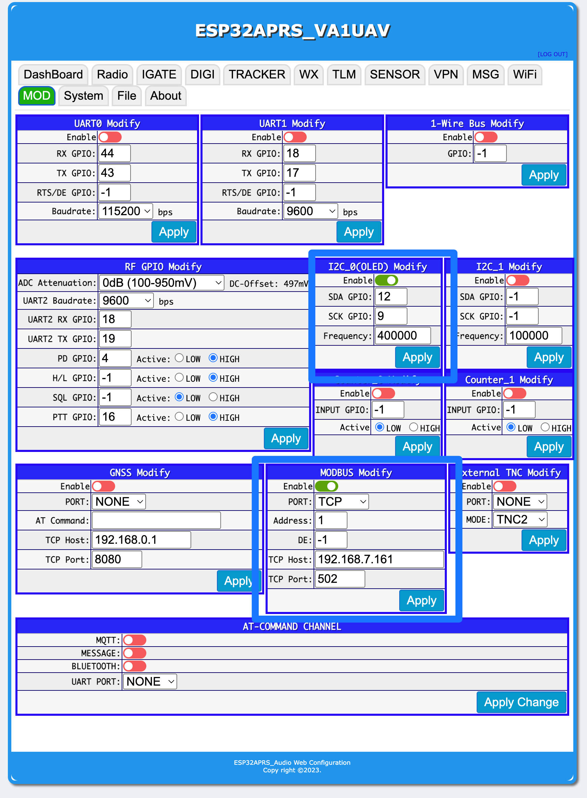

- **Sensor** — configure each sensor slot: type, scaling, and labels. For sensors that can't be wired directly, this page is also where the Modbus TCP connection to a companion weather gateway is set up. The two examples below show the same BME280 configured both ways — wired directly to the board, and read through a Modbus TCP gateway.

  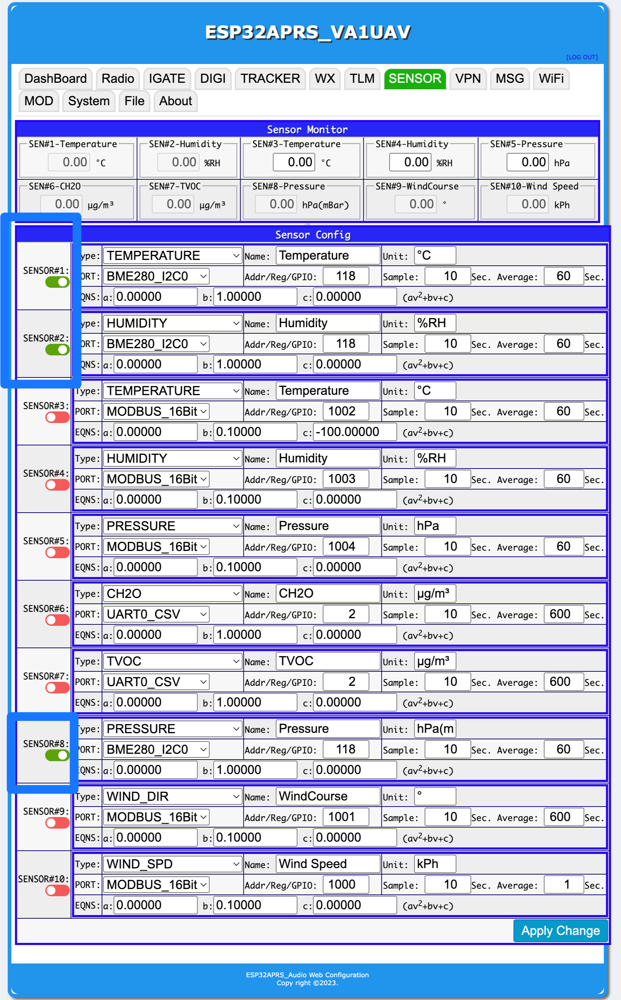

  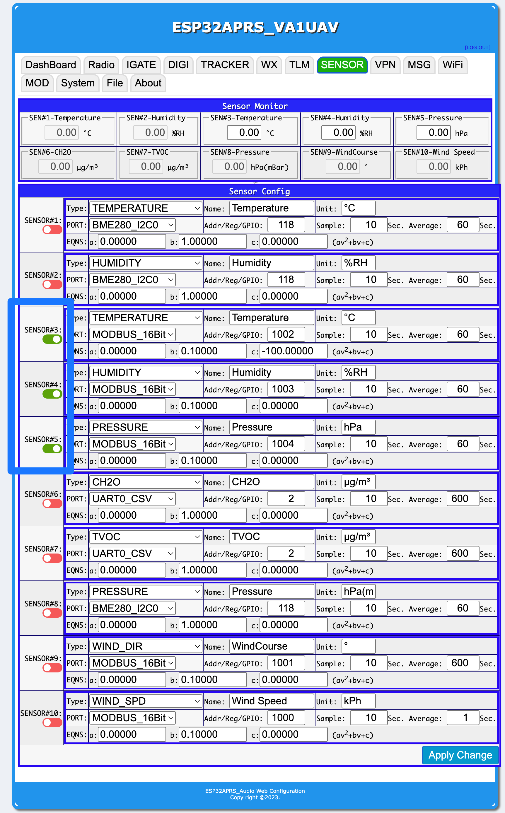

- **WX** (Weather) — configure the APRS weather reporting settings and map each configured sensor slot to its corresponding weather field (temperature, humidity, pressure, wind speed and direction, rain, etc.). This is the page that actually controls what gets transmitted as a weather beacon, so it's just as important as the Sensor page — a sensor that is read correctly but not mapped here will not show up in the outgoing APRS packets.

  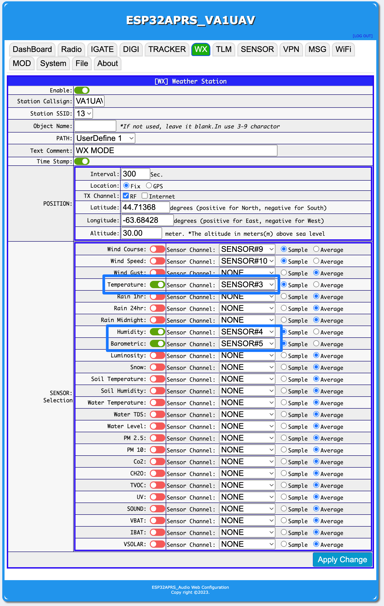

- **Wi-Fi** (optional but recommended for setup) — add credentials for your home or club Wi-Fi router. Much easier than using the standalone AP while you're still configuring. You can remove these later for deployment.

  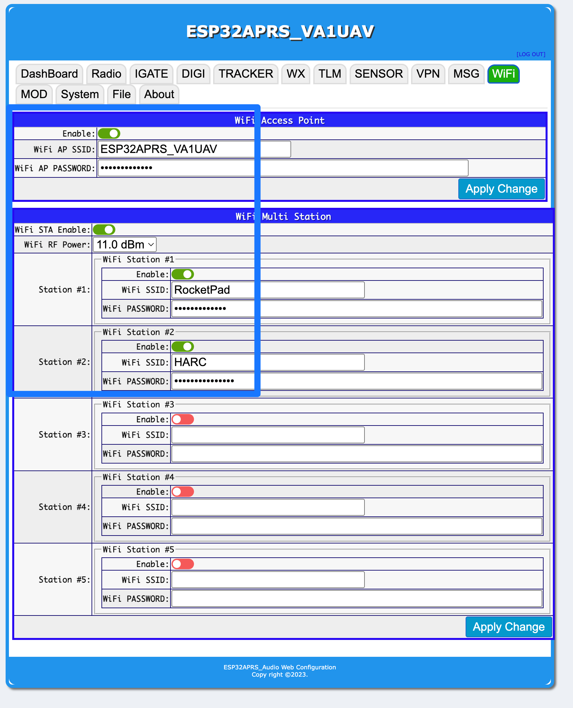

When you are done, the dashboard page shows received and transmitted packets in real time, and the sensor page shows live values from the sensors or weather gateway.

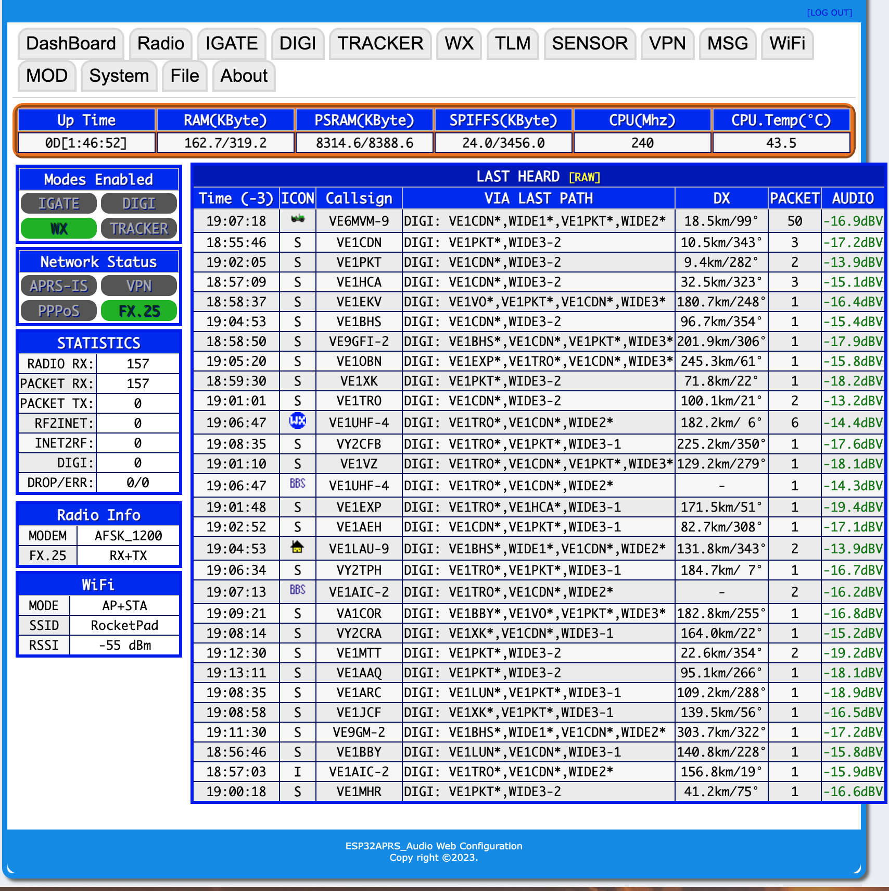

---

## Tools

The [`tools/`](tools/) directory contains utilities that don't require a toolchain installation:

- **[`flash.html`](tools/flash.html)** — browser-based firmware flasher using Espressif's [esptool-js](https://github.com/espressif/esptool-js) and the WebSerial API. Works in Chrome and Edge. See [`tools/FIRMWARE-FLASHER.md`](tools/FIRMWARE-FLASHER.md).
- **[`aprs_monitor.html`](tools/aprs_monitor.html)** — standalone APRS-IS packet monitor. Connects directly to an APRS-IS WebSocket server and decodes weather, position, message, telemetry, and object packets in the browser. No backend required. Auto-detects HTTP vs HTTPS and selects WS or WSS accordingly, so it can be opened locally or hosted on any web server. Useful for verifying that your station's packets are reaching APRS-IS and look correct.
- **[`merge_firmware.sh`](tools/merge_firmware.sh)** — shell script that combines bootloader, partition table, boot app, and application firmware into a single merged binary suitable for flashing at address `0x0`. Auto-detects flash size from the environment name:

  ```bash
  ./tools/merge_firmware.sh esp32-s3-devkitc1-n16r8
  # Output: tools/ESP32APRS-esp32-s3-devkitc1-n16r8.bin
  ```

Pre-built merged binaries for all supported environments are committed to the [`tools/`](tools/) directory so end users can skip the build step entirely.

---

## Development

Most users should just flash a pre-built binary using the instructions in [Getting Started](#getting-started) — the steps below are only needed if you want to build the firmware from source.

### Prerequisites

1. Install [Visual Studio Code](https://code.visualstudio.com/). Note: this is VS Code, *not* the older "Visual Studio" IDE.
2. Install [Python](https://www.python.org/). **Do not install a version newer than 3.13.x** — the Espressif build tools do not yet support newer Python releases. Check your existing version with `python -V`; if it is too new, uninstall it before installing 3.13.x.
3. Install [git](https://git-scm.com/).
4. Launch VS Code, open the **Extensions** panel, search for **pioarduino**, and install it. Restart VS Code when the installation finishes.

> [!WARNING]
> **Install the `pioarduino` extension — do NOT install `PlatformIO`.**
>
> Once `pioarduino` is running, VS Code will repeatedly prompt you to also install the separate **PlatformIO** extension. **Always dismiss these prompts.** Installing both extensions puts the build environment into a broken state from which it cannot be recovered without completely uninstalling and reinstalling the VS Code extensions (and sometimes VS Code itself). Several members of the HARC Builders Group have hit this — save yourself the trouble and just say no every time the popup appears.

### Getting the source

```bash
git clone https://github.com/RocketManRC/ESP32APRS_Audio_HARC.git
```

In VS Code, choose **File → Open Folder** and select the `ESP32APRS_Audio_HARC` directory. On first open, `pioarduino` will download the ESP32 toolchain and all library dependencies — this takes several minutes and is normal. Watch the status bar in the lower right for progress. It only happens once.

### Selecting a build environment

Open [`platformio.ini`](platformio.ini) and find the `default_envs` line near the top. Set it to the environment for your board, leaving only one entry active — for example:

```ini
default_envs = esp32-s3-devkitc1-n16r8
```

The available environments are listed in [Hardware](#hardware) above.

### Building and flashing

Connect the board to your computer with a **data-capable** USB cable.

#### Which USB port to use

Many ESP32-S3 dev boards expose **two** USB-C connectors: one goes directly to the ESP32-S3's built-in native USB peripheral, and the other is labeled **COM** or **UART** and connects through a USB-to-serial bridge chip (typically CP210x or CH340). **Prefer the COM/UART port** for both flashing and debugging:

- Firmware log output (`Serial.print`, ESP-IDF `log_*` macros) appears on the COM/UART port — not on the native USB port — so if you want to see what the board is doing over the serial monitor, this is the one you want.
- Several boards don't deliver enough current through the native USB port to run the firmware reliably; the COM/UART port tends to be more robust.
- On **macOS** the COM/UART port generally works with no driver setup at all. On **Windows** you may need to install a CP210x or CH340 driver the first time, depending on which bridge chip the board uses. Linux behaviour is not currently confirmed.

If the board has only a single USB-C port, use it — everything (power, flashing, and log output) runs through that one port.

#### Running a build

From VS Code, click the **✔** (build) and **→** (upload) icons in the status bar at the bottom of the window. Or from the command line:

```bash
pio run                                # build the default environment
pio run -e esp32-s3-devkitc1-n8r2      # build a specific environment
pio run --target upload                # flash the current environment
pio run --target monitor               # open serial monitor at 115200 baud
pio run --target clean                 # clean build artifacts
```

If the board doesn't enter programming mode automatically, hold the **BOOT** button while pressing and releasing **RESET** (or while plugging in the USB cable) to force it into the ROM bootloader, then retry the upload.

### Documentation

Architectural documentation — including the FreeRTOS task model, audio path, concurrency model, and the rationale behind several non-obvious design choices — is in [`CLAUDE.md`](CLAUDE.md). Additional topic-specific documentation lives in the [`doc/`](doc/) directory:

- [`doc/Modbus_Sensors.md`](doc/Modbus_Sensors.md) — Modbus sensor configuration and register mapping
- [`doc/Wind_Speed_Sensor.md`](doc/Wind_Speed_Sensor.md) — wind speed sensor notes
- [`doc/Counter_Sensors.md`](doc/Counter_Sensors.md) — pulse counter sensor notes
- [`doc/Startup_Timing.md`](doc/Startup_Timing.md) — boot sequence timing

---

## Credits

- **Somkiat Nakhonthai (HS5TQA)** — original author of ESP32APRS_Audio. This fork would not exist without his work. Please consider [sponsoring the upstream project](https://github.com/sponsors/nakhonthai) if you find it useful.
- **Halifax Amateur Radio Club Builders Group** — project direction, hardware design, and testing.
- Upstream credits to the [ESP32TNC](https://github.com/amedes/ESP32TNC), [LibAPRS](https://github.com/markqvist/LibAPRS), and [vp-digi](https://github.com/sq8vps/vp-digi) projects are preserved in [`README-upstream.md`](README-upstream.md).

## License

See [`LICENSE`](LICENSE) for license information. This fork retains the license of the upstream project.
